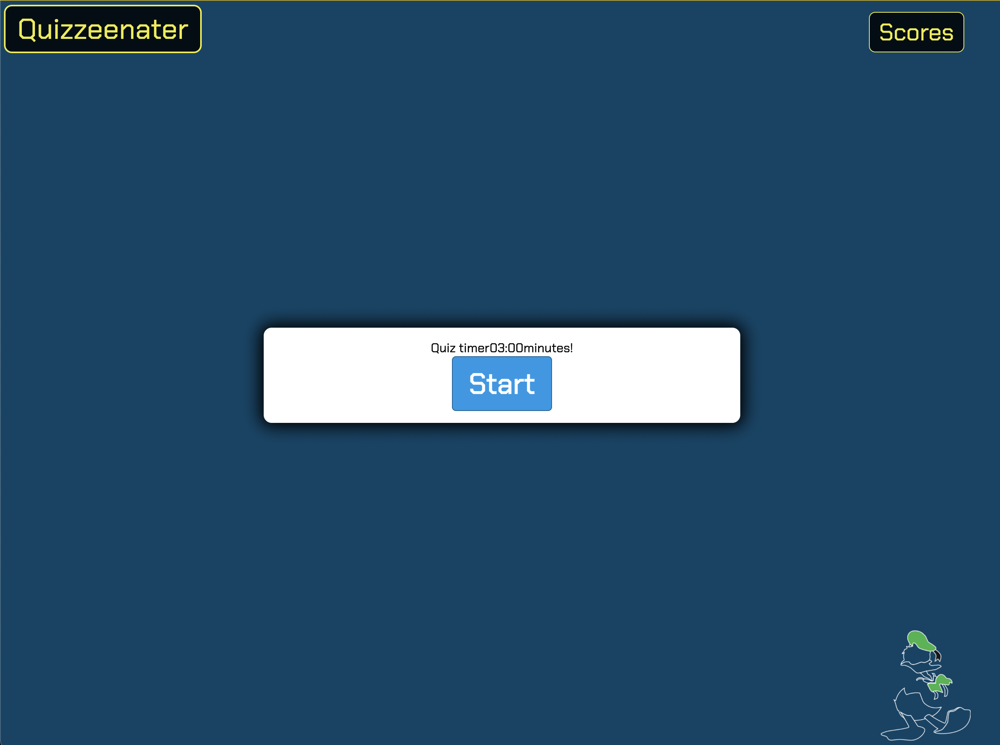
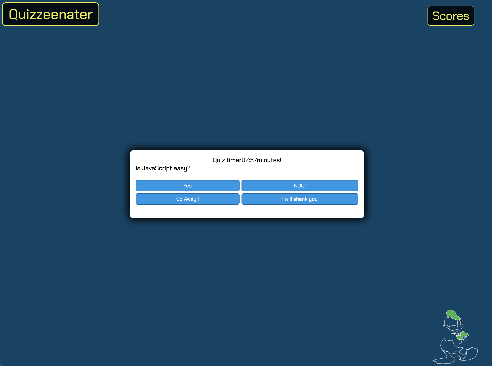
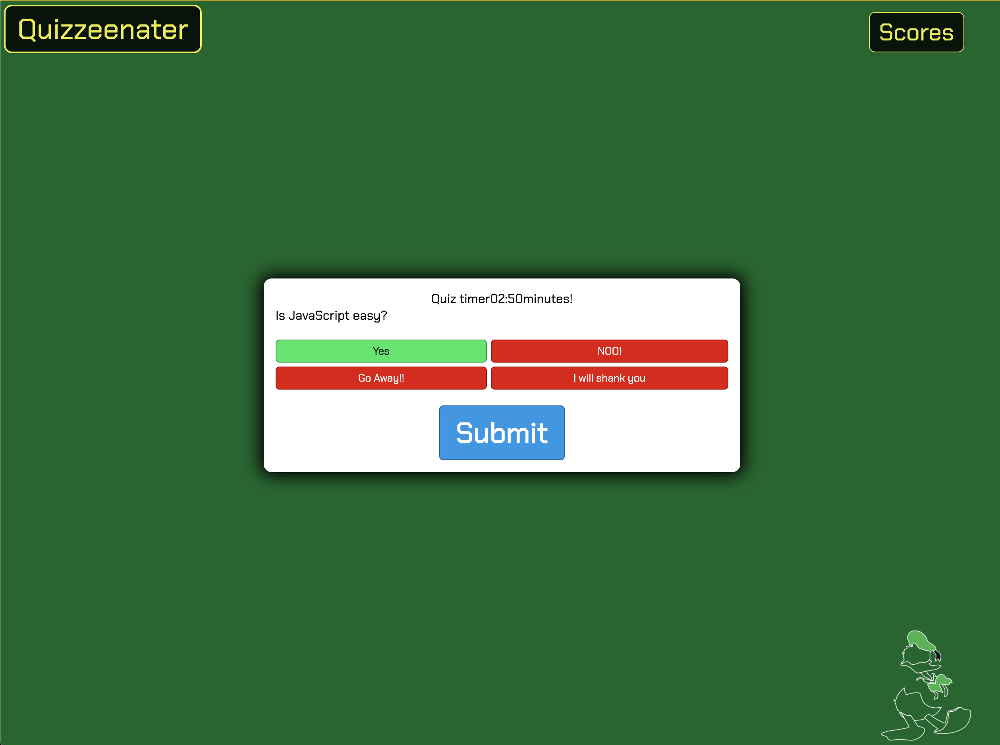
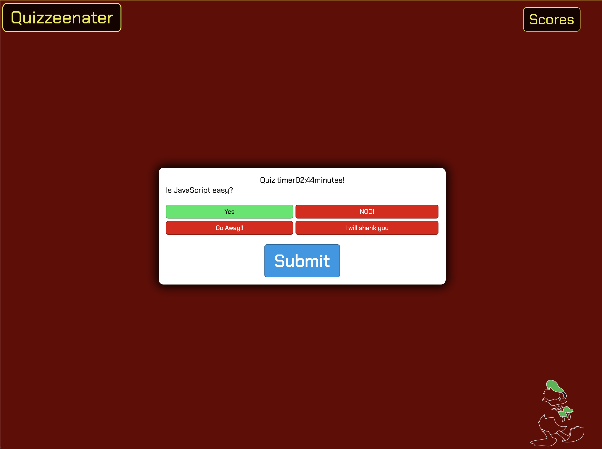
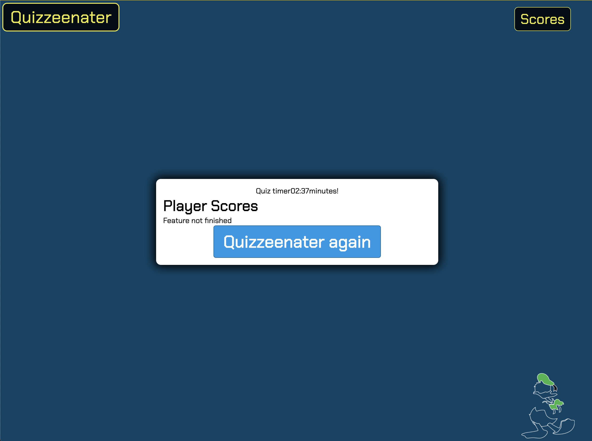

# Quiz 

# UO Coding bootcamp Challenge 4

## Links

Github Pages [Link](https://duckarroyo.github.io/challenge4/)

Github Repository [Link](https://github.com/DuckArroyo/challenge4)

## Description

This is a quiz application

## Project Guidelines/Requirements

None

# Contributions by:

DeveloperDuckArroyo

[Portfolio](https://duckarroyo.github.io/challenge2/)

[GitHub](https://github.com/DuckArroyo)

[Twitter @DevDuckArroyo](https://twitter.com/DevDuckArroyo)

[LinkeIn](https://www.linkedin.com/in/duckarroyo/)

[CodePen](https://codepen.io/DeveloperDuckArroyo)

# Screnshots

